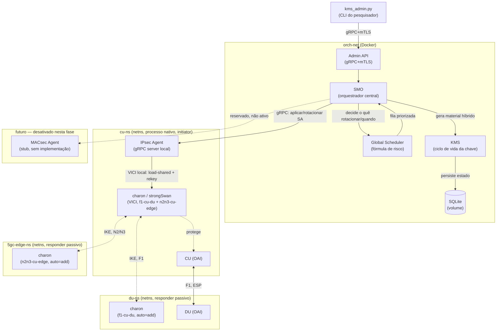

# Arquitetura do orquestrador — gerenciamento de chaves PQC por fatia

Redesenho a partir das ideias já validadas no `slice-aware-hpq-kms` (fórmula de
risco, ciclo de vida de chave, separação por fatia), mas repensado pra rodar
no ambiente real que você acabou de montar (OAI + Open5GS + netns), e sem
compromisso com a estrutura de pastas/código do repositório antigo.

**Ver também**: `ARQUITETURA-PROTOTIPO-COMPLETA.md` descreve um protótipo
de nó único (4 módulos: sniffer PFCP, classificador eBPF, XFRM+strongSwan)
que concretiza, num escopo menor e voltado a uma submissão (SBRC 2027), as
mesmas decisões de design daqui — o "Agente de Segurança" daquele
documento é a versão inicial do IPsec Agent descrito abaixo.

## Escopo desta fase

Ativo: rotação/revogação de chaves híbridas PQC(+QKD simulado) protegendo
**IPsec** nos enlaces F1-C/F1-U/E1 (midhaul, CU↔DU) e N2/N3 (backhaul,
CU↔5GC).

Fora de escopo, mas com lugar reservado no design: **MACsec** no fronthaul
(O-RU↔O-DU) — motivo já documentado no plano de experimentação (tráfego
fronthaul passa por DPDK, incompatível com um agente baseado em kernel/
Netlink; é trabalho do projeto irmão). O módulo aparece como interface
definida e desativada, não como código funcional.

## Resposta à pergunta de deployment: híbrido, não tudo container nem tudo nativo

Isso não é indecisão — é o que a própria topologia exige. Dois componentes
do seu sistema (**IPsec Agent** e, futuramente, o **MACsec Agent**) precisam
de acesso direto a recursos que são *escopados por namespace de rede*: o
socket VICI do `charon` (strongSwan) e o estado XFRM/Netlink vivem dentro do
netns onde o túnel é aplicado (`cu-ns`, no caso do F1 e do N2/N3, já que a CU
concentra os dois nessa topologia). Colocar esse agente num container
containerizaria também toda a complicação de expor esse namespace pra dentro
do container (bind mount de socket, `--network=container:`, etc.) sem
ganhar nada em troca — é mais simples rodar esse agente como processo nativo
*dentro* do próprio `cu-ns`, do mesmo jeito que o `gnb`/CU do OAI já roda lá.

Já o **SMO**, o **Global Scheduler**, o **KMS** e a **Admin API** não tocam
namespace nenhum — são lógica de aplicação pura, falando gRPC+mTLS entre si e
persistindo em SQLite. Esses sim ganham com containerização: consistência
com o próprio Open5GS (que já é Docker), isolamento de dependências Python,
facilidade de subir/derrubar sem afetar o resto do laboratório.

**Recomendação:** SMO + Scheduler + KMS + Admin API em containers Docker,
numa rede dedicada (`orch-net`); IPsec Agent nativo dentro do `cu-ns`. O
gRPC é o que une os dois mundos — funciona igual estando os dois lados
containerizados ou não, então o IPsec Agent expõe sua própria API gRPC (não
VICI cru) pro resto do sistema chamar; só ele fala VICI/Netlink localmente.



## Stack

Python em todos os componentes (SMO, Global Scheduler, KMS, IPsec Agent,
Admin API) — consistência com o protótipo anterior (`slice-aware-hpq-kms`,
`kms_admin.py`), `grpcio` como implementação gRPC, e as libs PQC relevantes
(`liboqs-python` ou equivalente) já têm binding Python maduro. O IPsec Agent
fala VICI via uma lib Python de socket VICI (ex. `vici` — o binding oficial
do próprio projeto strongSwan, já empacotado em `python3-vici` no Ubuntu).

## Componentes

### 1. SMO (orquestrador central)
Ponto único de coordenação. Recebe comandos administrativos (via Admin API),
consulta o Scheduler pra saber a próxima ação prioritária, aciona o KMS pra
gerar/renovar material de chave, e envia a instrução final pro agente certo
(hoje só o IPsec Agent; a interface pro MACsec Agent existe mas não é
chamada). Não guarda lógica de política nem lógica de kernel — só orquestra.

### 2. Global Scheduler
Mantém a fila de tarefas de rotação/revogação, classificadas em
`EMERGENCY > CRITICAL > NORMAL`, e dentro de cada classe ordena pelo maior
risco:

```
risk(i) = -slack(i)/estimated_cost(i) + slice_bonus(i) + interface_bonus(i) + aging(i)
```

(fórmula herdada do protótipo anterior — já validada conceitualmente,
mantida como está). `slice_bonus` favorece URLLC sobre eMBB/mMTC;
`interface_bonus` diferencia F1/E1 de N2/N3 se a política pedir; `aging`
evita starvation de tarefas de baixo risco que ficam paradas na fila. As
três políticas de escalonamento do plano de experimentação (risk-aware,
weighted-EDF, FIFO) são estratégias intercambiáveis dentro do Scheduler —
seleção de estratégia é um parâmetro de execução, não uma reestruturação de
código a cada cenário.

### 3. KMS (gerenciamento de ciclo de vida de chave)
Gera o material híbrido por fatia. Mapeamento corrigido pra bater com o
Open5GS já implantado (`5gc/config/smf.yaml`) — a versão anterior deste
documento tinha URLLC como SST 1 por engano; o SST real de cada fatia é
outro, a política de qual fatia recebe o quê continua a mesma:
- **URLLC (SST 2):** ML-KEM-768 + material de canal quântico simulado
  (via HKDF)
- **eMBB (SST 1) / mIoT (SST 3):** ML-KEM-512, sem componente quântico

Aplica as transições de estado: geração → distribuição → renovação →
revogação → quarentena → zeroização. Persiste estado e histórico em SQLite
(auditável, alinhado com o que o orientador vai querer ver nos resultados).

### 4. IPsec Agent (nativo, dentro do `cu-ns`)
Único componente com acesso direto a VICI/XFRM. Expõe uma API gRPC própria
pro SMO chamar ("aplicar SA X com material Y", "rotacionar SA Z",
"confirmar estado atual do túnel") — o SMO nunca fala VICI diretamente, só
fala com esse agente. Isso mantém o SMO/Scheduler/KMS portáveis (container,
outra máquina, etc.) sem se importar com onde o netns realmente vive.

Cobre os dois enlaces desta fase porque a CU concentra F1 (com a DU) e N2/N3
(com a borda do 5GC) na mesma topologia — um único agente, duas conexões
IPsec distintas geridas por ele:

- `f1-cu-du` — CU↔DU, transport mode, direto entre `cu-ns` e `du-ns`.
- `n2n3-cu-edge` — CU↔borda do 5GC, tunnel mode, terminando não na 5GC
  diretamente, mas num terceiro netns (`5gc-edge-ns`) que atua como membro
  real das redes Docker do Open5GS (sem NAT, via proxy-ARP pros aliases da
  CU) — ver `RUNBOOK-OAI.md` pro motivo (NAT quebrava o checksum SCTP do
  N2). O IPsec Agent não precisa saber desse detalhe de roteamento — só
  fala com o `charon` local e a conexão `n2n3-cu-edge` — mas o nome e a
  topologia real são esses, não `n2n3-ran-5gc`/enlace direto que aparecia
  nos `.conf.example` originais (que assumiam duas máquinas físicas na
  mesma LAN).

**Papéis assimétricos (initiator vs responder):** só o `cu-ns` (onde este
agente roda) tem `auto=start` nas duas conexões — ele é quem inicia e quem
comanda rotação. Os outros lados (`du-ns` pro F1, `5gc-edge-ns` pro N2/N3)
ficam com `auto=add` (carregam a config mas só respondem, nunca iniciam),
evitando os dois lados tentarem estabelecer a mesma SA ao mesmo tempo
depois de um restart.

**Mecanismo real de rotação (PSK dinâmico via VICI):** o strongSwan não tem
um comando de "instala essa chave literal numa SA já ativa" — o material
híbrido que o KMS gera vira o **PSK** da conexão (autenticação já é
`authby=psk` nos dois enlaces). O IPsec Agent troca a chave em dois passos:
1. `load-shared` via VICI — instala o novo PSK associado aos identificadores
   dos dois peers (substitui o segredo anterior daquela conexão).
2. Dispara um `rekey` (ou `initiate` de uma nova IKE_SA seguido de
   encerramento da antiga) — a reautenticação usa o PSK novo, então uma SA
   antiga com o PSK velho simplesmente não teria como se reautenticar depois
   disso, o que é o comportamento de revogação que a gente quer.

Autenticação por certificado fica como possível evolução futura (traria
identidade mais forte que PSK compartilhado), mas não é o caminho desta
fase — reconfigurar `authby` pros dois enlaces e montar uma mini-CA é
trabalho adicional sem ganho imediato pro que o experimento mede agora.

**Lacuna encontrada na implementação (item 3) e como foi contornada por
ora:** PSK é segredo bilateral — os dois lados de uma conexão precisam do
mesmo material pra reautenticação funcionar, mas esta seção só descreve
**um** agente, no `cu-ns`. Quem aplica o material no lado responder
(`du-ns`, `5gc-edge-ns`)? Nesta fase de VM única, o `ipsec_agent` que
implementamos contorna isso tendo acesso direto de filesystem aos sockets
VICI dos dois lados de cada conexão (todos os três netns moram na mesma
máquina) — ver `ipsec_agent/config.py` no repositório pra justificativa
completa. Isso **não se sustenta** quando DU e a borda do 5GC forem
máquinas físicas separadas (a topologia real da RNP): o Agent do `cu-ns`
não vai enxergar o socket VICI de uma máquina remota. Duas saídas
possíveis, nenhuma implementada ainda — decidir antes de migrar esse
código pra fora de uma VM única:
1. Um componente espelho, mais simples que o IPsec Agent completo, rodando
   no lado responder real — só carrega o material que o Agent do `cu-ns`
   manda por uma chamada de rede, sem precisar saber de política/rotação.
2. Um backend de segredos compartilhado (Vault, ou mais simples um arquivo
   sincronizado) que os dois lados leem — mais simples de montar, perde a
   auditoria centralizada que o VICI dá hoje.

### 5. MACsec Agent (interface reservada, não implementada)
Só a definição do contrato gRPC e o lugar no diagrama. Quando o projeto
`macsec_fronthaul` resolver a parte de MACsec-via-DPDK, a integração entra
aqui — sem precisar redesenhar o resto do sistema.

### 6. Admin API
gRPC+mTLS, igual ao protótipo anterior — é a interface que o `kms_admin.py`
(ou uma CLI nova) usa pra comandos administrativos (revogar, colocar em
quarentena, forçar rotação, liberar).

## Fluxo — rotação de chave (caminho principal)

1. Scheduler detecta que uma tarefa de rotação (agendada ou disparada por
   risco) é a próxima da fila.
2. SMO pede ao KMS o novo material híbrido pra aquela fatia/interface.
3. KMS gera, registra o estado (`pending`) no SQLite, retorna o material.
4. SMO chama o IPsec Agent (gRPC) pedindo pra aplicar o novo material na SA
   correspondente (`f1-cu-du` ou `n2n3-cu-edge`).
5. IPsec Agent instala o material como PSK via VICI (`load-shared`) e
   dispara o rekey da IKE_SA; confirma sucesso/falha pro SMO.
6. SMO atualiza o estado no KMS (`active` ou `failed` → aciona
   revogação/quarentena se falhou) e registra o evento no audit log.

## O que fica fora desta fase (mas não é esquecido)

- MACsec real / DPDK / integração com `macsec_fronthaul` — interface
  reservada, sem código.
- RU/UE físico — a arquitetura acima roda idêntica trocando só o endereço
  IP do endpoint IPsec quando migrar pra RNP (mesma premissa que já estava
  no `security/README-integration.md` do kit local).

## Ordem sugerida pra começar a construir

1. **Contratos gRPC primeiro** (`.proto` do SMO↔Scheduler↔KMS↔IPsec Agent↔
   Admin API) — define as fronteiras antes de escrever lógica, evita
   retrabalho de interface depois.
2. **KMS isolado e testável** — gerar/revogar/zerar material híbrido sem
   nenhuma dependência de rede real ainda (testes unitários com o
   ML-KEM/HKDF).
3. **IPsec Agent nativo mínimo** — aplicar uma SA manualmente via VICI a
   partir de um material fixo, confirmar que funciona antes de conectar ao
   resto.
4. **Scheduler com a fórmula de risco** — fila priorizada, testável com
   cenários sintéticos (sem precisar do ambiente todo de pé).
5. **SMO amarrando os quatro** — só depois que cada peça funciona isolada.
6. **Admin API por último** — é a camada mais fácil de adicionar depois,
   sem risco de travar o resto.

Se quiser, no próximo passo eu ajudo a esboçar o `.proto` dos contratos gRPC
(item 1) — é o ponto de partida mais natural pra você já abrir o editor e
começar a codar.
